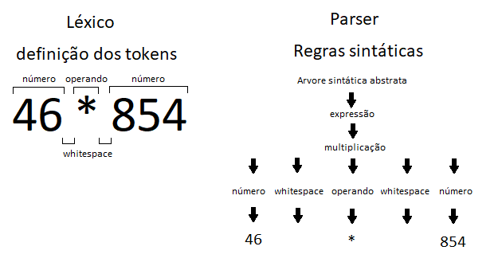

# ANTLR - _Another Tool For Language Recognition_

### Discentes
> Fernando Henrique Callata, 
> Kayo Martins, 
> Murillo Gordo, 
> Marcos Rafael Lapa de Sousa, 
> Saulo Calixto.

## 1. Introdução

O presente artigo tem o objetivo de introduzir ao leitor uma ferramenta de parsing que tem sido usada com sucesso para ler, processar e executar textos ou arquivos binários, ANTLR. Muitos softwares hoje utilizam-na para auxiliar em suas soluções, como o Twitter em seu motor de busca, o Hibernate, Netbeans, etc.

Para compreender melhor o significado de ANTLR, é importante entender o conceito de _parsing_, ou em português, análise sintática. _Parsing_, normalmente, envolve reconhecer e organizar, com base numa gramática formal, informações que estão em formato de _tokens_ numa estrutura de dados, usualmente uma árvore (mais especificamente uma árvore sintática abstrata, ou árvore de análise sintática). Para agilizar a criação da gramática formal, tem-se como ferramenta o ANTLR: um gerador de _parser_.

Com o fim didático de apresentar a ferramenta como algo que pode ser utilizada para solucionar diversos problemas, o presente artigo irá apresentar de forma prática como essa ferramenta pode ser usada, e também discorrendo sobre alguns conceitos importantes para o entendimento da ferramenta como um todo.

## 2. Gramática Formal

Para começar a utilizar o ANTLR a primeira coisa que deve-se fazer é definir uma gramática formal, composta principalmente por dois componentes, os _lexers_ (analisadores léxicos) e _parsers_ (analisadores sintáticos).

Os _lexers_ identificam cada menor unidade de entrada e agrupam ela em símbolos, como por exemplo: definindo as regras léxicas para a entrada "46 * 854", ela será interpretada pelo lexer, como cada número sendo representado pelo símbolo _"número"_, e os espaços como _"whitespace"_. O _lexer_ também definirá que todos os números juntos antes de um _whitespace_ ou caractere diferente serão um número também. Essas definições de número e _whitespace_, são os símbolos (_tokens_) e são utilizados pelo _parser_ como elementos de texto mínimos que serão identificados numa expressão. Nesse caso, a regra de _parser_ irá identificar que um token número, seguido do símbolo " * " e outro token número, constituem uma expressão e denotará isso como "multiplicação". O ANTLR oferece suporte para a geração de _lexers_ e de _parsers_, cuja forma de criação de ambos será posteriormente explicada neste artigo.



Como o ANTLR sabe quais são os tokens, como ele consegue distinguir que isso é uma operação matemática? Simples, nós o "ensinamos" ao criar a gramática formal.
```
/*
* Regras de parsing
*/
operacao : NUMERO '+' NUMERO;

/*
* Regras lexicais
*/
NUMERO : [0-9]+;
ESPACOEMBRANCO : ' ' -> skip;
```
Esse exemplo acima é uma prévia da definição de uma gramática formal utilizando o ANTLR. Como podem ver definimos regras lexicais e de parsing.

Nas regras lexicais foram definidos dois tokens, _NUMERO_ e _ESPACOEMBRANCO_, o primeiro é composto por um ou mais dígitos de 0 à 9. O segundo diz ao analisador que o espaço em branco deve ser ignorado.

Nas regras de parsing os tokens são utilizados, e é definido o que fazer com eles. Nisso é decidido que uma _operacao_ é composta do token NUMERO e o sinal '+', de forma que sempre que tivermos esses tokens na ordem descrita na regra o ANTLR irá considerar isso uma operação.

A gramática formal é necessária para que o ANTLR possa analisar o código passado, definindo ela podemos usar essa ferramenta para resolver diversos problemas, como um gerador de querys sql, análise de textos de buscas, etc.

### 2.1. Abordagens para criar uma gramática

Existem duas grandes estratégias que pode-se adotar ao criar uma gramática, a de cima para baixo consiste em começar com a organização geral de como um arquivo é organizado, quais suas seções, qual a ordem, o que tem em cada seção, e assim ir especificando para regras mais baixo nível até a menor parte. Esta estratégia é boa quando quem está definindo a gramática tem um bom conhecimento teórico para conhecer toda a organização do arquivo em que está trabalhando.

Alternativamente, e mais comumente, podemos atacar o problema de baixo para cima, inicialmente definindo os tokens, como eles se agrupam e as expressões básicas aplicadas a eles, e após isso definimos estruturas de mais alto nível e organização do arquivo. Esta estratégia permite começar com parte menores, seguir um raciocínio mais simples subindo de nível aos poucos ao invés de saber toda a organização do arquivo desde o início.

## 3. Como o ANTLR funciona?
O Antlr é composto de duas partes, a ferramenta que tem o papel de criar o analisador léxico e a que gera o analisador sintático. Além disso tem o runtime responsável por aplicar a gramática.

Uma vez que a gramática é criada pode-se usá-la em várias soluções, seja em Java, Python, C#, Javascript, etc. o Antlr te dá a possibilidade de trabalhar em diversas linguagens, o que diferencia é apenas o runtime que é especifico para cada linguagem.

A despeito das diversas variedades de linguagens em que o Antlr pode ser aplicado, nesse artigo será abordada apenas sua aplicação em Java.
Todos os exemplos da instalação serão dados para o ambiente Linux.

### 3.1. Configurando o Antlr
O Antlr pode ser baixado do [site oficial](http://www.antlr.org/download/antlr-4.7.1-complete.jar).
Ao baixar esse arquivo você deve copiá-lo para `/usr/local/lib` (Linux) ou `C:\Program Files\Java\libs` (Windows).
Para facilitar o uso você pode criar CLASSPATH para poder fazer a chamada direta do Antlr no terminal. Para adicionar o CLASSPATH, siga os passos abaixo:

```
~$ cd ~
~$ nano .bashrc
~$ sudo cp antlr-4.7.1-complete.jar /usr/local/lib/
//// Adicione essa linha ao final do bashrc.
export CLASSPATH=$CLASSPATH:/usr/local/lib/antlr-4.7.1-complete.jar:$CLASSPATH
alias antlr4='java -Xmx500M -cp "/usr/local/lib/antlr-4.7.1-complete.jar:$CLASS$
alias grun='java org.antlr.v4.gui.TestRig'
```
Agora o Antlr já está instalado e devidamente configurado, pronto para ser usado. Com isso já é possível criar a gramática com os analisadores léxicos e analisadores sintáticos, cujos serão armezenados em um arquivo de extensão *.g4*.

### 3.2. Antlr e Java
Nessa seção será descrito como pode-se utilizar a gramática gerada pelo Antlr no Java. Para isso usaremos o *Maven* que é uma ferramenta de automação e gerenciamento de projetos Java. 
Para usar o Antlr com o Maven basta configurar o pom, incluindo as dependências para o runtime do Antlr.

Para adicionar as dependências do Antlr ao projeto Maven deve-se adicionar a seguinte dependência no pom:
```
<dependencies>
	<dependency>
		<groupId>org.antlr</groupId>
		<artifactId>antlr4-runtime</artifactId>
		<version>4.7</version>
	</dependency>
</dependencies>
```
Também é necessário colocar o plugin para que a gramática *.g4* seja compilada antes dos arquivos Java, com a seguinte sintaxe no pom.

```
<plugin>
	<groupId>org.antlr</groupId>
	<artifactId>antlr4-maven-plugin</artifactId>
	<version>4.7</version>
	<executions>
		<execution>
			<goals>
				<goal>antlr4</goal>
			</goals>
		</execution>
	</executions>
</plugin>
```
Além disso é possivel configurar a ferramenta de forma que o Java gere automaticamente os listeners e os visitors para a gramática, adicionando a seguinte configuração ao Pom.

```
<properties>
	<project.build.sourceEncoding>UTF-</project.build.sourceEncoding>
	<antlr4.visitor>true</antlr4.visitor>
	<antlr4.listener>true</antlr4.listener>
</properties>
```
Depois de configurado o Pom, basta colocar as gramáticas geradas dentro da pasta: `src/main/antlr4/package` e rodar o comando:

```
$~ mvn package
```
Esse comando gerará o _lexer_ e o _parser_ e eles serão compilados com o resto do seu código.


## 4. Usando o ANTLR
Após ter tudo configurado pode-se finalmente criar uma gramática.
As gramáticas no Antlr são guardadas em arquivos com extensão *.g4* e possuem um cabeçalho que indica o nome da gramática. Então a primeira coisa que precisamos fazer é criar o arquivo da gramática:
```
$~ touch calculadora.g4
$~ nano calculadora.g4
```
A primeira coisa que é definida é o nome da gramática e isso é feito com a palavra reservada *grammar* seguida do nome da gramática, **que deve ser o mesmo nome do arquivo**.
Uma informação importante é que ao final de cada declaração deve-se colocar o "**;**" para indicar que foi finalizada a declaração.
Pode-se começar definindo primeiramente os analisadores sintáticos e depois os léxicos.
Segue uma demonstração da criação de uma gramática simples de calculadora. Ela apenas receberá uma expressão matemática que contém apenas os operadores **+ - * /** e será responsável por avaliá-la.

```
grammar Calculadora;  
  
/*  
*Analisador sintático  
**/  
  
prog: expr;  
expr: expr op=(MULT|DIV) expr  # OpBin  
  | expr op=(MAIS|MENOS) expr  # OpBin  
  | PARENTABER expr PARENTFECH # par  
  | INT                        # num  
  ;  
  
/*  
*Analisador léxico  
**/  
  
INT : ('0'..'9')+ ;  
MAIS : '+' ;  
MENOS : '-' ;  
MULT : '*' ;  
DIV : '/' ;  
PARENTABER : '(' ;  
PARENTFECH : ')' ;
```
Essa é a gramática definida. Primeiramente foi denotado o token INT, o qual pode ser formado de dígitos que vão de 0 à 9, podendo ter mais de um dígito. Além dele foi definido também os tokens: MAIS, MENOS, MULT, DIV PARENTABER, PARENTFECH. Os tokens são usados nas regras sintáticas e possuem ordem certa para aparecerem, como ficou definido acima, por exemplo uma expressão não pode começar com PARENTFECH, ou ter dois operadores seguidos.
No analisador sintático temos um *prog* que é formado por uma *expr*, essa por sua vez pode ser formada por outras *expr*, números, operadores ou parênteses.
É bom notar que a regra *expr* é formado por 4 linhas, cada linha representa uma possibilidade para a regra e o pipe **|** indica que qualquer uma dessas expressões são válidas.  Ao final de cada opção é dado um nome para ela indicado pelo caractere **#**.

### 4.1. Usando a gramática em um projeto Java

Agora que a gramática está pronta o próprio ANTLR se encarregará de gerar os arquivos necessários para que a gramática seja usada num projeto Java.
A primeira coisa a fazer é *"compilar"* a gramática com o antlr4, para isso basta rodar o comando:
```
$~ antlr4 Calculadora.g4
```
Após esse comando é chamado o compilador java para gerar os arquivos necessários para que a gramática seja utilizada:
```
$~ javac Calculadora*.java
```
Após esse comando ser rodado vários arquivos *.java* são gerados, entre eles os parsers, os lexers, os listeners, etc. Esses arquivos java precisam ser adicionados aos projetos java criados para que eles possam ser usados.
Um dos arquivos mais importantes gerados é o *CalculadoraListener*, nele teremos vários métodos de entradas e saída que vão representar cada regra sintática criada. Pode-se sobrescrever esses métodos afim de usar os dados gerados pelo analisador no software em questão.
Os arquivos de _Lexers_ e _Parsers_ representam as regras que criadas na gramática, não é necessário fazer alterações neles.
Nesse ponto já tem-se todo o insumo necessário para usar a gramática. Caso seja do desejo do usuário obter os resultados do _parser_ basta implementar o Listener e sobrescrever os métodos das regras, fazendo o tratamento que considerar pertinente.
Não serão abordados detalhes da implementação, pois isso depende do uso que se deseja dar para sua gramática, contudo, a fim de entender melhor como foi feito, pode-se acessar [o projeto no github](./Projeto/calculadoraantlr).

## 5. Conclusão
O Antlr é de fato uma ferramenta muito útil, pois ela facilita a vida do desenvolvedor ajudando-o a criar sua própria linguagem. Fazer manualmente todo o processo de receber uma entrada e formatar ela para uma linguagem conhecida demandaria muito esforço, além de um bom conhecimento de *expressões regulares*.
Por mais que seja possível fazer isso sem o Antlr, o esforço para tal seria hérculeo e pouco eficiente.
A utilidade do Antlr vem sendo provada ao longo dos anos com a quantidade de soluções que aproveitam dessa poderosa ferramenta em seus projetos.
Espera-se desse artigo o leitor possa vislumbrar a ferramenta, assim como adquirir o conhecimento de como dar os primeiros passos na sua instalação, utilização e implementação e de como ela pode ser útil no dia a dia.

## 6. Referências
  1. [ANTLR](http://www.antlr.org/)
  2. [The ANTLR Mega Tutorial](https://tomassetti.me/antlr-mega-tutorial/)
  3. [ANTLR Repository](https://github.com/antlr/antlr4)
  4. [Sung Kyun Kwan University ANTLR Tutorial](http://arcs.skku.edu/pmwiki/uploads/Courses/ProgrammingLanguages/ANTLR-tutorial.pdf)
  5. [MinhaCalculadora](https://gist.github.com/lrlucena/b150cba803ddab1005d3)
